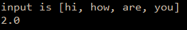

```.py
def wordLength(lst:list):
    num=len(lst)
    sum=0
    for i in range(num-1):
        sum = sum+len(lst[i])
    average = sum/num
    return average
print('input is [hi, how, are, you]')
print(wordLength(['hi', 'how', 'are', 'you']))

```

