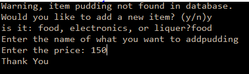

```.py

def total(items:list, amount:list):
    food = ["bread", 'rice']
    electronics = ['ipad', 'tv']
    liquer = ['water','beer']
    price = 0
    for i in range(len(items)):
        current_item = items[i]
        if current_item in food:
            price += 1.1*amount[i]
        elif current_item in electronics:
            price += 1.15*amount[i]
        elif current_item in liquer:
            price += 1.2*amount[i]
        else:
            print(f'Warning, item {current_item} not found in database.')
            addNew = input('Would you like to add a new item? (y/n)')
            if addNew == 'y':
                state=1
                n = input('is it: food, electronics, or liquer?')
                new = n.lower()
                if new == 'food':
                    food.append(input('Enter the name of what you want to add'))
                elif new == 'electronics':
                    electronics.append(input('Enter the name of what you want to add'))
                elif new == 'liquer':
                    liquer.append(input('Enter the name of what you want to add'))    
            else:
                print('Thank You')
                state=0
                break
            if state==1:
                i = input('Enter the price: ')
                amount.append(i)
                print('Thank You')
                break

item = ['bread', 'pudding']
price = [100, 225]
total(item, price)

```




