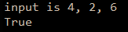

```.py
def bubbleSort(arr:kust):
    n = len(arr)
    for i in range(n-1):
        for j in range(0, n-i-1):
            if arr[j] > arr[j + 1] :
                arr[j], arr[j + 1] = arr[j + 1], arr[j]
 
def evenlySpaced(a:int, b:int, c:int):
    lst=[]
    lst.append(a)
    lst.append(b)
    lst.append(print('input is 4, 2, 6')c)
    bubbleSort(lst)
    if lst[1] - lst[0] == lst[2]-lst[1]:
        result = 'True'
    else:
        result = 'False'
    return result
    
print('input is 4, 2, 6')
print(evenlySpaced(4, 2, 6))

```

