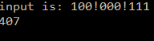

```.py
def reverseMode(inp:str):
    A = inp
    dec_a = 4*int(A[0])+2*int(A[1]) + 1*int(A[2])
    dec_b = 4*int(A[4])+2*int(A[5]) + 1*int(A[6])
    dec_c = 4*int(A[8])+2*int(A[9]) + 1*int(A[10])
    out = dec_a*100 + dec_b*10 + dec_c
    return out

print('input is: 100!000!111')
print(reverseMode('100!000!111'))

```



