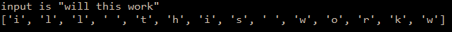

```.py
def bubbleSwap(inp):
    chars = list(inp)
    l =len(inp)
    for i in range(l-1):
        chars[i], chars[i+1]=chars[i+1], chars[i]
    return chars
print('input is "will this work"')
print(bubbleSwap("will this work"))
```

