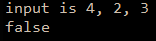

```.py
#given 3 side lengths, can they form a triangle
def triangle(a, b, c):
    if a+b>c & a+c>b & b+c>a:
        result = 'true'
    else:
        result = 'false'
    return result
print('input is 4, 2, 3')
print(triangle(4, 2, 3))
```

