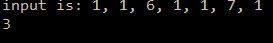

```.py
#Add all numbers in a list, except for contents between a 6 and a 7
def sum67(inp):
    current=0
    indexi=0
    indexn=0
    sub = 0
    for ele in inp:
        current+=1
        if ele == 6:
            indexi=current
        elif ele == 7:
            indexn=current
    for i in inp[indexi-1:indexn]:
        sub += i
    sub = sum(inp)-sub
    return sub
    
print('input is: 1, 1, 6, 1, 1, 7, 1')
print(sum67([1, 1, 6, 1, 1, 7, 1]))
```

